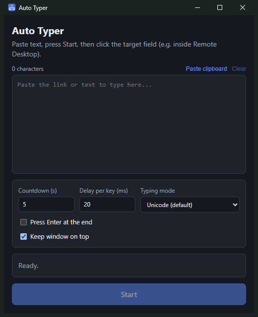

<p align="center">
  
</p>

<h1 align="center">Auto Typer: paste into Remote Desktop by typing it</h1>

<p align="center">
  <b>A free, open-source Windows auto typer for RDP, VMs and consoles where copy-paste doesn't work.</b><br />
  You paste your text, press <b>Start</b> and click the target window. Auto Typer then types the text as real keystrokes.
</p>

<p align="center">
  <a href="https://github.com/PShanuKa/Auto-Typer/releases/latest"></a>
  <a href="https://github.com/PShanuKa/Auto-Typer/releases"></a>
  
  <a href="LICENSE"></a>
</p>

<p align="center">
  
</p>

---

## Why Auto Typer?

Clipboard sharing is often turned off. This happens in **Remote Desktop (RDP)** sessions, **VMware / Hyper-V / VirtualBox**
consoles, **Citrix**, **iDRAC / iLO / IPMI** KVM consoles, **Proxmox noVNC**, jump hosts and BIOS or installer screens.
Typing a 200-character URL, a config string or a license key by hand is slow and easy to get wrong.

Auto Typer runs on **your** PC. It sends your text as keyboard input, so the remote machine sees normal typing.
Nothing needs to be installed on the remote side.

## Features

- **Types any text as keystrokes**, including long links, commands, JSON, multi-line scripts and tabs
- **Countdown before typing** (default 5 s) gives you time to click the right window
- **Adjustable delay per key** so slow RDP or VNC links don't drop characters
- **Two typing modes:**
  - *Unicode* (default) supports any language, including non-Latin scripts like Sinhala and Tamil
  - *Scan code* sends physical key presses, for consoles that ignore Unicode input
- **Optional Enter at the end**
- **Cancel at any time** with the button or the global hotkey `Ctrl + Alt + X`
- **Always-on-top** window, with settings that are remembered between runs
- **No telemetry.** It works offline and doesn't read or send anything except the text you give it
- Available as an installer or a **portable** single `.exe`

## Download

| Package | Link |
|---------|------|
| Installer (Start menu + desktop shortcut) | [**Auto-Typer-Setup.exe**](https://github.com/PShanuKa/Auto-Typer/releases/latest/download/Auto-Typer-Setup.exe) |
| Portable (no install) | [**Auto-Typer-Portable.exe**](https://github.com/PShanuKa/Auto-Typer/releases/latest/download/Auto-Typer-Portable.exe) |

All versions are on the [Releases page](https://github.com/PShanuKa/Auto-Typer/releases).

> **"Windows protected your PC"?** The app isn't code-signed yet, so SmartScreen may show a warning on first run.
> Click **More info → Run anyway**. If Windows **Smart App Control** is on, it may block unsigned apps completely.
> In that case, build from source (see below). The full source is in this repo, and the release `.exe` files are
> built by [GitHub Actions](.github/workflows/release.yml) from it.

## How to use

1. Open **Auto Typer** and paste your text, or click **Paste clipboard**.
2. Press **Start**. A countdown begins.
3. Before it ends, **click into the field** you want to type into, for example inside the Remote Desktop window.
4. Watch the text being typed. Press `Ctrl + Alt + X` to stop.

### Tips

- **Characters missing or wrong in RDP / VNC?** Raise *Delay per key* to 40–80 ms, or switch *Typing mode* to *Scan code*.
- **Scan code mode** uses the key layout of the remote machine. Make sure both sides use the same keyboard layout
  (for example US).
- **Auto-indenting editors** (like VS Code or Notepad++) may add extra indentation when you type multi-line code.
  Type into a plain editor instead, or turn off auto-indent.

## FAQ

**How do I paste text into a Remote Desktop session when the clipboard doesn't work?**
Use Auto Typer: paste the text here, press Start and click inside the RDP window. It types the text for you.

**Does it work with VMware, Hyper-V, VirtualBox, Proxmox, iDRAC or iLO consoles?**
Yes. It works with any window that accepts keyboard input. For BIOS, boot or pre-login screens, use *Scan code* mode.

**Is it safe?**
Yes. Auto Typer is open source and has no network access, no telemetry and no background service. It only sends keys
while a typing run is in progress.

**Does it need admin rights?**
No. It runs as a normal user. Windows doesn't let normal apps type into windows running as administrator. To type
into one of those, run Auto Typer as administrator too.

## Build from source

Requirements: **Windows 10/11**, **Node.js 20+**.

```bash
git clone https://github.com/PShanuKa/Auto-Typer.git
cd Auto-Typer
npm install
npm run dev          # run in development mode
npm run dist         # build Auto-Typer-Setup.exe and Auto-Typer-Portable.exe into release/
npm run pack         # build only the unpacked app folder (release/win-unpacked)
npm run install-app  # after "pack": copy it to %LOCALAPPDATA%\Programs and add shortcuts (no installer exe)
```

`install-app` / `uninstall-app` are useful on PCs where Smart App Control blocks unsigned installers.

### How it works

- **UI:** React + Vite, running in an Electron window
- **Typing engine:** [`resources/typer.ps1`](resources/typer.ps1) calls the Win32 `SendInput` API through PowerShell,
  with `KEYEVENTF_UNICODE` for Unicode mode and `KEYEVENTF_SCANCODE` for scan code mode. It doesn't use any native
  Node modules.

### Releasing

Bump `version` in `package.json`, then push a tag:

```bash
git tag v1.0.1
git push origin v1.0.1
```

The [release workflow](.github/workflows/release.yml) builds the installer and the portable `.exe` and attaches them to a
GitHub Release.

## Contributing

Issues and pull requests are welcome. If you find a console or app where typing doesn't work, please
[open an issue](https://github.com/PShanuKa/Auto-Typer/issues). Include the target app and the typing mode you used.

## License

[MIT](LICENSE) © 2026 Pasindu Shanuka

<sub>Keywords: auto typer, autotype, type clipboard, paste into RDP, remote desktop paste not working, clipboard
redirection disabled, send keystrokes, keyboard emulator, VMware console paste, Hyper-V paste text, iDRAC iLO
paste, noVNC paste, Citrix paste, Windows typing tool.</sub>
